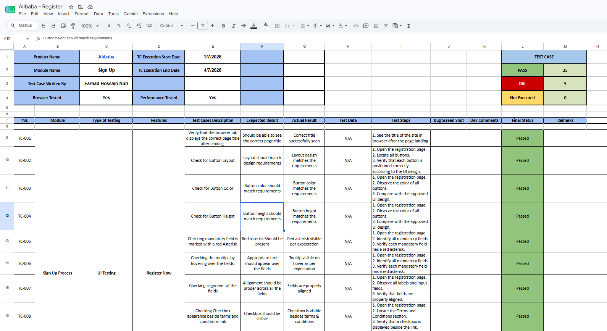
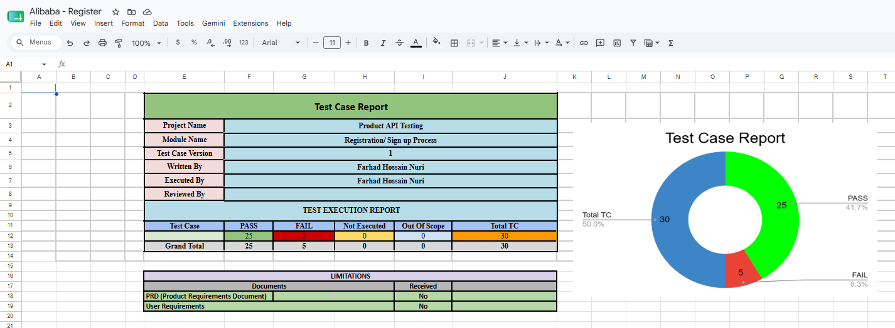
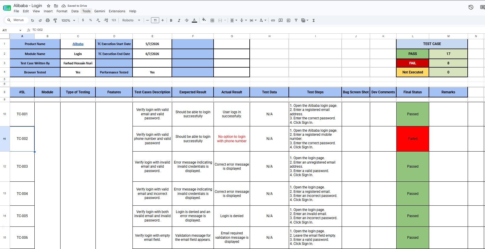
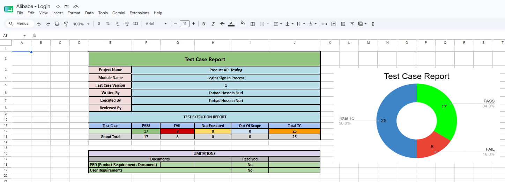
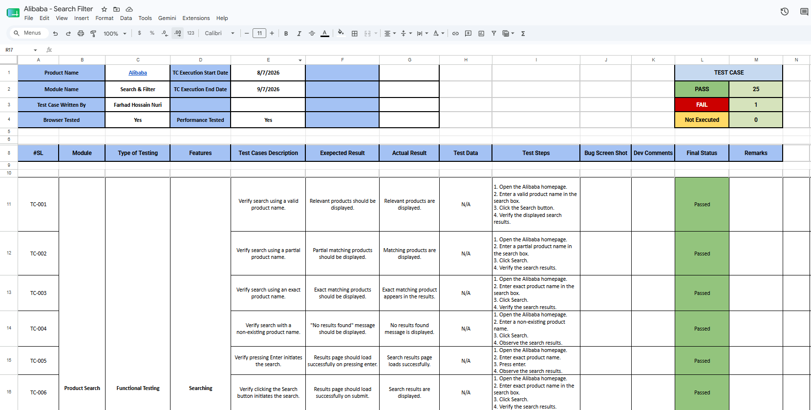
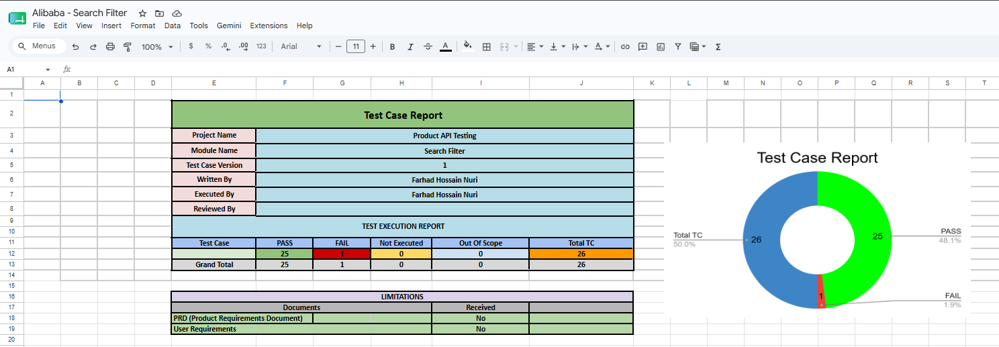

# Alibaba Manual Testing

## Project Description

This repository presents a professional-grade manual testing project for the **Alibaba E-commerce Platform**, focusing on core functionalities like user registration (Sign up), authentication (Login), and product search operations. It includes a complete suite of manual test cases, detailed bug reports, completion reports, and documentation to demonstrate best practices in quality assurance for web applications.

## Manual Testing Documentation & Resources
| Resources                     | Link                                              |
| ---------------------------- | ------------------------------------------------- |
| Register Test Cases          | [Alibaba Register Test Cases](https://docs.google.com/spreadsheets/d/1Nkzt9WC2rQxPLZ8PTsZRpW6ck2EK0RcpJUh0A_RF5-s/edit?usp=sharing) |
| Login Test Cases             | [Alibaba Login Test Cases](https://docs.google.com/spreadsheets/d/1hpRKmPoz6sdGrYcqeTo276qZsXQuQl0pm7LH1DOEoYE/edit?usp=sharing) |
| Product Search Test Cases    | [Alibaba Product Search Test Cases](https://docs.google.com/spreadsheets/d/1JMf6p9IklNIo-lBdRrKcDl1LXGSzke9o2KlIn1h_cYg/edit?usp=sharing) |

---
## Key Features
* Comprehensive manual testing covering functional, boundary, and negative test scenarios for Sign Up, Login, and Search modules.
* End-to-end manual test execution verifying actual behavior against expected outcomes.
* Detailed completion reporting with execution insights and overall pass/fail metrics.
* Validation of user interface, form validations, authentication, and search functionalities.
* Well-documented bug reports and improvement recommendations for better software quality.
* Structured traceability and systematic QA checklists.

## Screenshots

---
## Technologies & Tools Used
| Tool                      | Purpose                                  |
| ------------------------- | ---------------------------------------- |
| **Web Browser**           | Manual Application Execution & Verification |
| **Google Sheets / Excel** | Test Case Management, Bug Tracking & Reports |

---
## Experience & Insights Gained
* Designed and executed comprehensive manual test cases based on e-commerce web application requirements.
* Validated UI/UX, form submissions, user authentication, and search functionalities manually across multiple scenarios.
* Maintained professional bug reports, QA checklists, and completion reports.
* Strengthened practical knowledge of functional, boundary, and negative testing techniques for web platforms.
* Developed structured test cases with clear steps, expected results, and accurate requirement mappings.

---
## Author

**Farhad Nuri**

